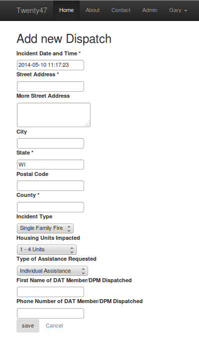
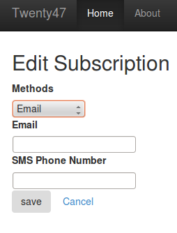

User Documentation for Twenty47!
====================================

Contents:

.. toctree::
   :maxdepth: 2

Purpose
=======
Twenty47 allows simple input of basic dispatch information. This data
is then pushed to email or SMS subscribers. For most users, there are
2 forms available, the Dispatch Create and the Subscriber forms.

   

Indices and tables
==================

* :ref:`genindex`
* :ref:`modindex`
* :ref:`search`

