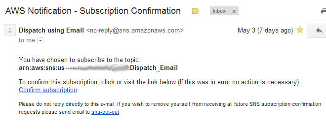
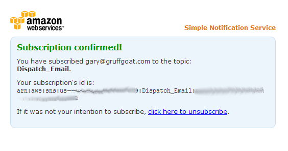
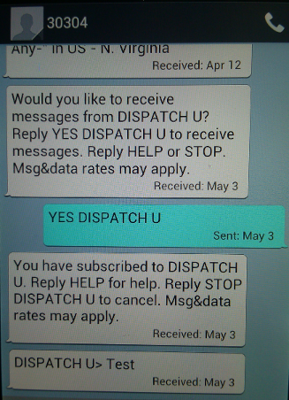

################################
For Users
################################

Contents:

.. toctree::
   :maxdepth: 2

Purpose
=======
Twenty47 allows simple input of basic dispatch information. This data
is then pushed to email or SMS subscribers. For most users, there are
2 forms available.

The Dispatch Create form
========================
The use of Dispatch Create should be self-explanatory. Upon submission,
Dispatch Create sends a notification to all subscribers.

.. image:: _static/dispatch_create.png
   :alt: Create a new dispatch form

The Subscriber form
===================
This form is also self-explanatory. What happens after pressing "Save" 
does, however; require more explanation. Also before selecting "SMS
Phone", make certain you have a phone capable of receiving SMS text
messages and you are aware of any fees your service provider might charge.

.. image:: _static/subscriber.png
   :alt: Manage your subscription form
   

Effects of Subscriber form
--------------------------
All subscribers must be approved before they are allowed to receive
notifications. Once you submit your subscription request, a Subscription
Manager receives an email notification of your request. The Subscription
Manager must then approve your request. Once your request is approved, 
you will receive confirmation notices for your email or your SMS phone.

Email Confirmation
^^^^^^^^^^^^^^^^^^
Once a Subscription Manager approves your request, you will received an
email requiring you to confirm your request. This will come from 
**Dispatch using Email** <no-reply\@sns.amazonaws.com>. Click the included
link to complete your subscription.

Once you have confirmed, you will be directed to a page similar to this:
   

SMS Phone Confirmation
^^^^^^^^^^^^^^^^^^^^^^
Once a Subscription Manager approves your request, you will receive an 
SMS text requiring you to confirm your request. That SMS will come from
30304. You must then reply "YES DISPATCH". Finally, you will receive a
confirmation. All SMS notifications will come from 30304 and include 
"DISPATCH>"

See the image to understand this more clearly.

   
Changing Subscription
---------------------
Once your subscription is approved, you may return to the Subscriber
form to make any changes you wish.

Resending Confirmation
----------------------
Ocassionally, it may be neccessary to resend the subsciption confirmation
email or text. Once you are approved for subscriptions, a resend
confirmation button appears on the form.

Indices and tables
==================

* :ref:`genindex`
* :ref:`modindex`
* :ref:`search`

